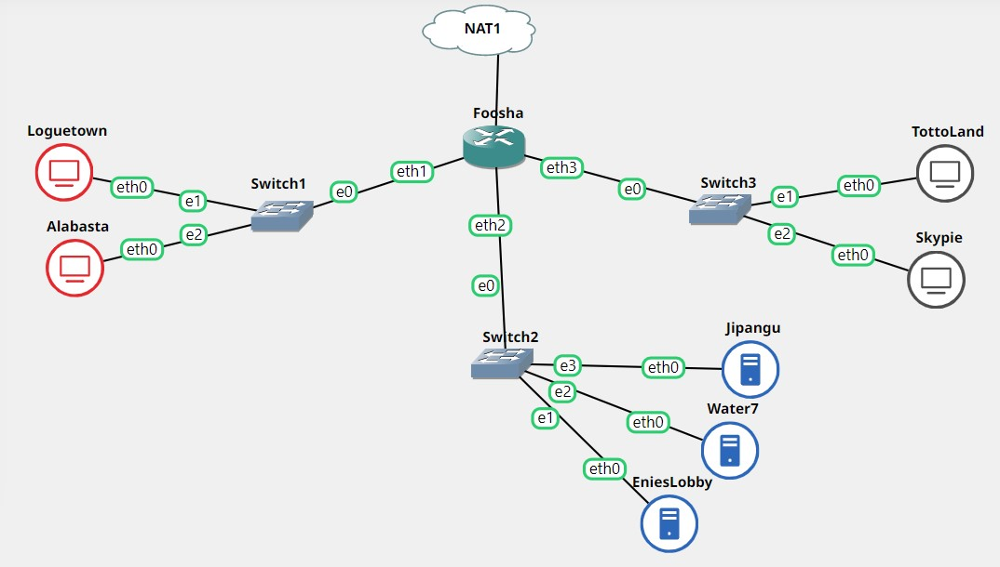
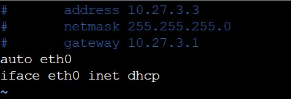
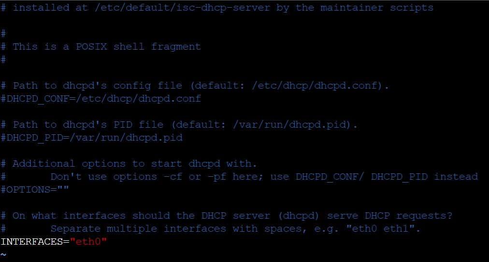
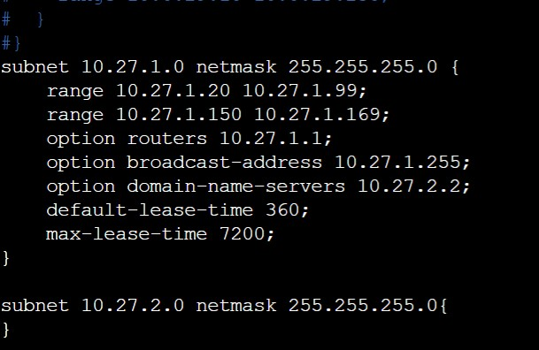
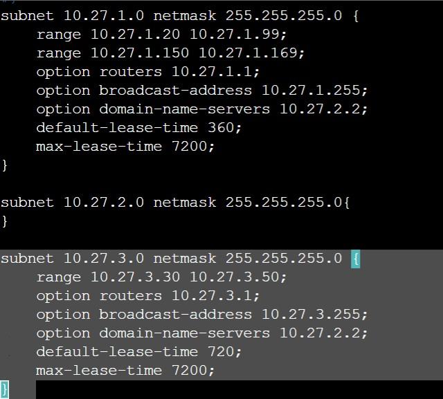

# Jarkom-Modul-3-D12-2021

Laporan Resmi Praktikum Jaringan Komputer 2021 - D12

- Nur Hidayati (05111940000028)
- Pramudityo Prabowo (05111940000210)
- Muhammad Rizky Widodo (05111940000216)

## SOAL 1

Membuat peta tersebut dengan kriteria EniesLobby sebagai DNS Server,
Jipangu sebagai DHCP Server, Water7 sebagai Proxy Server.

### Solusi:

**Membuat Topologi Jaringan**

Sebelum memulai, terlebih dahulu kita membuat topologi jaringan yaitu
sebagai berikut:




Terdapat 1 router dengan 3 switch, 4 client, dan 3 server.

**Mengedit Konfigurasi Jaringan**

Setting Foosha sebagai router dengan interface eth0, eth1, eth2, dan
eth3.


Setting EniesLobby sebagai DNS Server


Setting Jipangu sebagai DHCP Server


Setting Water7 sebagai Proxy Server


Setting Loguetown sebagai Client


Setting Alabasta sebagai Client


Setting Tottoland sebagai Client


Setting Skypie sebagai Client




Setelah berhasil membuat topologi jaringan dan mengedit konfigurasinya.
Langkah selanjutnya yaitu menginstall aplikasi yang di butuhkan pada
masing-masing server:

Pada EniesLobby menginstall bind9

```

apt-get update

apt-get install bind9

```

Pada Jipangu menginstall isc-dhcp-server

```

apt-get update

apt-get install isc-dhcp-server

```

Pada Water7 menginstall squid

```

apt-get update

apt-get install squid

```

## SOAL 2

Melakukan setting agar Foosha sebagai DHCP Relay.

### Solusi:

Langkah pertama yaitu menginstall isc-dhcp-relay pada Foosha dengan
command

```

apt-get update

apt-get install isc-dhcp-relay

```

Lalu mengedit dengan command \`vi /etc/default/isc-dhcp-relay\` agar
diarahkan ke DHCP Server yaitu Jipangu dan interfaces-nya yaitu eth1,
eth2, eth3.


Menjalankan command \`/etc/init.d/isc-dhcp-relay start\`

Selanjutnya pada Jipangu interfaces-nya diedit eth0 dengan command \`vi
/etc/default/isc-dhcp-server\`.




Menjalankan command \`service isc-dhcp-server start\` dan mengecek
statusnya sudah *running* dengan command \`service isc-dhcp-server
status\`.

## SOAL 3

Semua client yang ada HARUS menggunakan konfigurasi IP dari DHCP Server.
Client yang melalui Switch1 mendapatkan range IP dari \[prefix IP\].1.20
- \[prefix IP\].1.99 dan \[prefix IP\].1.150 - \[prefix IP\].1.169

### Solusi:

Pertama mengedit file /etc/dhcp/dhcpd.conf dengan command \`vi
/etc/dhcp/dhcpd.conf \` sehingg konfigurasinya sebagai berikut:

```

subnet 10.27.1.0 netmask 255.255.255.0 

range 10.27.1.20 10.27.1.99;

range 10.27.1.150 10.27.1.169;

option routers 10.27.1.1;

option broadcast-address 10.27.1.255;

option domain-name-servers 10.27.2.2;

default-lease-time 360;

max-lease-time 7200;

}

subnet 10.27.2.0 netmask 255.255.255.0

}

```




## SOAL 4

Client yang melalui Switch3 mendapatkan range IP dari \[prefix IP\].3.30
- \[prefix IP\].3.50

### Solusi:

Pertama mengedit file /etc/dhcp/dhcpd.conf dengan command \`vi
/etc/dhcp/dhcpd.conf \` sehingg konfigurasinya sebagai berikut:

```

subnet 10.27.3.0 netmask 255.255.255.0 

range 10.27.3.30 10.27.3.50;

option routers 10.27.3.1;

option broadcast-address 10.27.3.255;

option domain-name-servers 10.27.2.2;

default-lease-time 720;

max-lease-time 7200;

}

```




Menjalankan command \`service isc-dhcp-server restart\`

Pada soal no 3 dan 4, melakukan testing apakah masing-masing client
telah mendapatkan IP setelah semua client di setting IP dinamisnya dari
DHCP Server dengan command \`ip a\`.

Loguetown


Alabasta


Tottoland


Skypie


## SOAL 5

Client mendapatkan DNS dari EniesLobby dan client dapat terhubung dengan
internet melalui DNS tersebut.

### Solusi:

Pertama, melakukan setting agar EniesLobby menjadi DNS Forwarder dengan
mengedit file /etc/bind/named.conf.options dengan command \`vi
/etc/bind/named.conf.options\`.


Selanjutnya melakukan command \`service bind9 restart\`.

Untuk mengeceknya, maka dapat menjalankan command \`cat
/etc/resolv.conf\` pada masing-masing client.

Loguetown


Alabasta


Tottoland


Skypie


## SOAL 6

Lama waktu DHCP server meminjamkan alamat IP kepada Client yang melalui
Switch1 selama 6 menit sedangkan pada client yang melalui Switch3 selama
12 menit. Dengan waktu maksimal yang dialokasikan untuk peminjaman
alamat IP selama 120 menit.

### Solusi:

Pada Jipangu membuka file /etc/dhcp/dhcpd.conf. Pada subnet 1 dengan
\`default-lease-time 360\` dan \`max-lease-time 7200\`.


Sedangkan, pada subnet 3 dengan \`default-lease-time 720\` dan
\`max-lease-time 7200\`.


## SOAL 7

Menjadikan Skypie sebagai server dengan alamat IP yang tetap dengan IP
\[prefix IP\].3.69

### Solusi:

Pertama, pada Jipangu membuka file konfigurasi /etc/dhcp/dhcpd.conf dan
mengeditnya \`vi /etc/dhcp/dhcpd.conf\` dengan menambahkan konfigurasi
berikut:

```

host Skypie 

hardware ethernet c6:e1:99:99:42:22;

fixed-address 10.27.3.69;

}

```


Menjalankan command \`service isc-dhcp-server restart\`.

Kemudian, pada client Skypie membuka file /etc/network/interfaces dan
mengeditnya dengan menambahkan konfigurasi berikut:

```

hwaddress ether c6:e1:99:99:42:22

```


Melakukan restart pada client Skypie di halaman GNS3.

Melakukan testing dengan menjalankan command \`ip a\`.


