# Jarkom-Modul-3-D12-2021

Laporan Resmi Praktikum Jaringan Komputer 2021 - D12

- Nur Hidayati (05111940000028)
- Pramudityo Prabowo (05111940000210)
- Muhammad Rizky Widodo (05111940000216)

## SOAL 1

Membuat peta tersebut dengan kriteria EniesLobby sebagai DNS Server, 
Jipangu sebagai DHCP Server, Water7 sebagai Proxy Server.

### Solusi:

**Membuat Topologi Jaringan**

Sebelum memulai, terlebih dahulu kita membuat topologi jaringan yaitu
sebagai berikut:


Terdapat 1 router dengan 3 switch, 4 client, dan 3 server.

**Mengedit Konfigurasi Jaringan**

Setting Foosha sebagai router dengan interface eth0, eth1, eth2, dan
eth3.


Setting EniesLobby sebagai DNS Server


Setting Jipangu sebagai DHCP Server


Setting Water7 sebagai Proxy Server


Setting Loguetown sebagai Client


Setting Alabasta sebagai Client


Setting Tottoland sebagai Client


Setting Skypie sebagai Client


Setelah berhasil membuat topologi jaringan dan mengedit konfigurasinya.
Langkah selanjutnya yaitu menginstall aplikasi yang di butuhkan pada
masing-masing server:

Pada EniesLobby menginstall bind9

```
apt-get update
apt-get install bind9
```

Pada Jipangu menginstall isc-dhcp-server

```
apt-get update
apt-get install isc-dhcp-server
```

Pada Water7 menginstall squid

```
apt-get update
apt-get install squid
```

## SOAL 2

Melakukan setting agar Foosha sebagai DHCP Relay.

### Solusi:

Langkah pertama yaitu menginstall isc-dhcp-relay pada Foosha dengan
command

```
apt-get update
apt-get install isc-dhcp-relay
```

Lalu mengedit dengan command `vi /etc/default/isc-dhcp-relay` agar
diarahkan ke DHCP Server yaitu Jipangu dan interfaces-nya yaitu eth1,
eth2, eth3.


Menjalankan command `/etc/init.d/isc-dhcp-relay start`.

Selanjutnya pada Jipangu interfaces-nya diedit eth0 dengan command `vi
/etc/default/isc-dhcp-server`.


Menjalankan command `service isc-dhcp-server start` dan mengecek
statusnya sudah *running* dengan command `service isc-dhcp-server
status`.

## SOAL 3

Semua client yang ada HARUS menggunakan konfigurasi IP dari DHCP Server.
Client yang melalui Switch1 mendapatkan range IP dari [prefix IP].1.20-[prefix IP].1.99 
dan [prefix IP].1.150-[prefix IP].1.169

### Solusi:

Pertama mengedit file /etc/dhcp/dhcpd.conf dengan command `vi
/etc/dhcp/dhcpd.conf` sehingg konfigurasinya sebagai berikut:

```
subnet 10.27.1.0 netmask 255.255.255.0 {
    range 10.27.1.20 10.27.1.99;
    range 10.27.1.150 10.27.1.169;
    option routers 10.27.1.1;
    option broadcast-address 10.27.1.255;
    option domain-name-servers 10.27.2.2;
    default-lease-time 360;
    max-lease-time 7200;
}

subnet 10.27.2.0 netmask 255.255.255.0 {
}
```


## SOAL 4

Client yang melalui Switch3 mendapatkan range IP dari [prefix IP].3.30-[prefix IP].3.50

### Solusi:

Pertama mengedit file /etc/dhcp/dhcpd.conf dengan command `vi
/etc/dhcp/dhcpd.conf` sehingg konfigurasinya sebagai berikut:

```
subnet 10.27.3.0 netmask 255.255.255.0 {
    range 10.27.3.30 10.27.3.50;
    option routers 10.27.3.1;
    option broadcast-address 10.27.3.255;
    option domain-name-servers 10.27.2.2;
    default-lease-time 720;
    max-lease-time 7200;
}
```


Menjalankan command `service isc-dhcp-server restart`.

Pada soal no 3 dan 4, melakukan testing apakah masing-masing client
telah mendapatkan IP setelah semua client di setting IP dinamisnya dari
DHCP Server dengan command `ip a`.

Loguetown


Alabasta


Tottoland


Skypie


## SOAL 5

Client mendapatkan DNS dari EniesLobby dan client dapat terhubung dengan
internet melalui DNS tersebut.

### Solusi:

Pertama, melakukan setting agar EniesLobby menjadi DNS Forwarder dengan
mengedit file /etc/bind/named.conf.options dengan command `vi
/etc/bind/named.conf.options`.


Selanjutnya melakukan command `service bind9 restart`.

Untuk mengeceknya, maka dapat menjalankan command `cat
/etc/resolv.conf` pada masing-masing client.

Loguetown


Alabasta


Tottoland


Skypie


## SOAL 6

Lama waktu DHCP server meminjamkan alamat IP kepada Client yang melalui
Switch1 selama 6 menit sedangkan pada client yang melalui Switch3 selama
12 menit. Dengan waktu maksimal yang dialokasikan untuk peminjaman
alamat IP selama 120 menit.

### Solusi:

Pada Jipangu membuka file /etc/dhcp/dhcpd.conf. Pada subnet 1 dengan
`default-lease-time 360` dan `max-lease-time 7200`.


Sedangkan, pada subnet 3 dengan `default-lease-time 720` dan
`max-lease-time 7200`.


## SOAL 7

Menjadikan Skypie sebagai server dengan alamat IP yang tetap dengan IP
[prefix IP].3.69

### Solusi:

Pertama, pada Jipangu membuka file konfigurasi /etc/dhcp/dhcpd.conf dan
mengeditnya `vi /etc/dhcp/dhcpd.conf` dengan menambahkan konfigurasi
berikut:

```
host Skypie {
    hardware ethernet c6:e1:99:99:42:22;
    fixed-address 10.27.3.69;
}
```


Menjalankan command `service isc-dhcp-server restart`.

Kemudian, pada client Skypie membuka file /etc/network/interfaces dan
mengeditnya dengan menambahkan konfigurasi berikut:

```
hwaddress ether c6:e1:99:99:42:22
```


Melakukan restart pada client Skypie di halaman GNS3.

Melakukan testing dengan menjalankan command `ip a`.


## SOAL 8
Pada Loguetown, proxy harus bisa diakses dengan nama jualbelikapal.yyy.com dengan port yang digunakan adalah 5000

### Solusi:

Pertama, pada Water7 melakukan backup file /etc/squid/squid.conf dengan menggunakan command `mv /etc/squid/squid.conf /etc/squid/squid.conf.bak`.

Selanjutnya menambahkan script berikut dengan command `vi /etc/squid/squid.conf `

```
http_port 5000
visible_hostname jualbelikapal.d12.com
http_access allow all
```

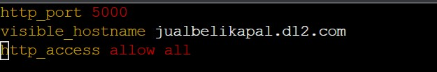

Selanjutnya melakukan command `service squid restart`.

Pada client Loguetown, jangan lupa untuk menginstall lynx.

```
apt-get update
apt-get install lynx
```

Setelah terinstall, melakukan konfigurasi proxy servernya dengan command `export http_proxy="http://10.27.2.3:5000"`.

Kemudian untuk mengecek apakah sudah aktif dengan cara command `env | grep -i proxy`.

Untuk mengeceknya dengan command `lynx its.ac.id`. 

## SOAL 9
Agar transaksi jual beli lebih aman dan pengguna website ada dua orang, proxy dipasang autentikasi user proxy dengan enkripsi MD5 dengan dua username, yaitu luffybelikapalyyy dengan password luffy_yyy dan zorobelikapalyyy dengan password zoro_yyy

### Solusi:
Pada Water7, menjalankan `apt-get update` dan `apt-get install apache2-utils`.

Kemudian menjalankan command `htpasswd -cm /etc/squid/passwd luffybelikapald12`, option `c` digunakan untuk membuat file baru, sedangkan `m` digunakan supaya enkripsinya menggunakan MD5. Setelah itu memasukkan password `luffy_d12`.
Kemudian menjalankan command `htpasswd -m /etc/squid/passwd zorobelikapald12`. Setelah itu masukkan password `zoro_d12`.

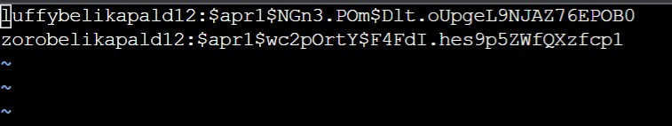

Setelah itu, mengedit file /etc/squid/squid.conf dengan command `vi /etc/squid/squid.conf` 

```
http_port 5000
visible_hostname jualbelikapal.d12.com

auth_param basic program /usr/lib/squid/basic_ncsa_auth /etc/squid/passwd
auth_param basic children 5
auth_param basic realm Proxy
auth_param basic credentialsttl 2 hours
auth_param basic casesensitive on
acl USERS proxy_auth REQUIRED
http_access allow USERS
```

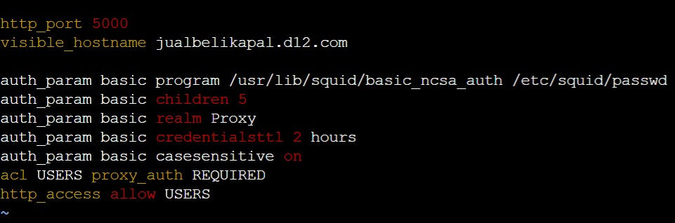

Kemudian menjalankan command `service squid restart`.

Untuk mengeceknya, pada client Loguetown menjalankan command `lynx its.ac.id` yang selanjutnya akan diminta untuk memasukkan username dan password.

## SOAL 10
Transaksi jual beli tidak dilakukan setiap hari, oleh karena itu akses internet dibatasi hanya dapat diakses setiap hari Senin-Kamis pukul 07.00-11.00 dan setiap hari Selasa-Jum’at pukul 17.00-03.00 keesokan harinya (sampai Sabtu pukul 03.00)

### Solusi:
Pada Water7 menambahkan script berikut pada file /etc/squid/acl.conf dengan command `vi /etc/squid/acl.conf`

```
    acl AVAILABLE_WORKING time MTWH 07:00-11:00
    acl AVAILABLE_WORKING time TWHF 17:00-23:59
    acl AVAILABLE_WORKING time WHFA 00:00-03:00
```

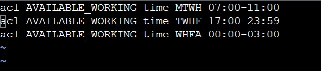

Setelah itu mengedit file pada /etc/squid/squid.conf dengan command `vi /etc/squid/squid.conf` menjadi

```
include /etc/squid/acl.conf
http_port 5000
visible_hostname jualbelikapal.d12.com
auth_param basic program /usr/lib/squid/basic_ncsa_auth /etc/squid/passwd
auth_param basic children 5
auth_param basic realm Proxy
auth_param basic credentialsttl 2 hours
auth_param basic casesensitive on
acl USERS proxy_auth REQUIRED
http_access allow USERS AVAILABLE_WORKING
http_access deny all 
```

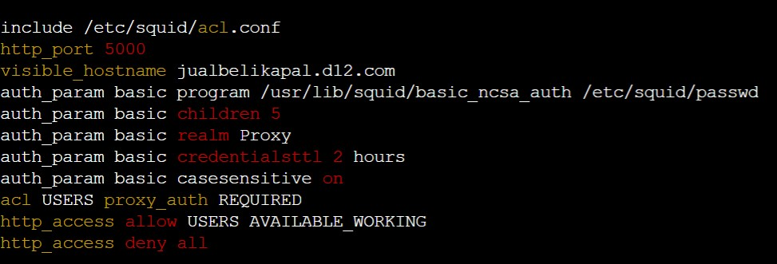

Kemudian menjalankan command `service squid restart`.

Untuk mengeceknya, pada client Loguetown menjalankan command `date` untuk mengetahui tanggal dan waktu saat dijalankan. Selanjutnya menjalankan command `lynx its.ac.id` apabila date sesuai dengan yang diminta soal maka berhasil dibuka dan sebaliknya.

## SOAL 11
Agar transaksi bisa lebih fokus berjalan, maka dilakukan redirect website agar mudah mengingat website transaksi jual beli kapal. Setiap **mengakses google.com, akan diredirect menuju super.franky.yyy.com** dengan website yang sama pada soal shift modul 2. Web server super.franky.yyy.com berada pada node **Skypie**
### Solusi :

Pertama EniesLobby, mengedit file pada /etc/bind/named.conf.local dengan command `vi /etc/bind/named.conf.local` dan menambahkan

```
    zone "super.franky.d12.com" {
        type master;
        file "/etc/bind/sunnygo/super.franky.d12.com";
    };
```

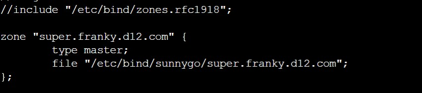

Selanjutnya membuat folder sunnygo dengan command `mkdir /etc/bind/sunnygo`. Setelah itu, men-copy file dengan command `cp /etc/bind/db.local /etc/bind/sunnygo/super.franky.d12.com`. Kemudian menambahkan konfigurasi dengan command `vi /etc/bind/sunnygo/super.franky.d12.com`
```
$TTL    604800
@       IN      SOA     super.franky.d12.com. root.super.franky.d12.com. (
                                 2			; Serial
                            604800		; Refresh
                            86400		; Retry
                            2419200		; Expire
                            604800 )		; Negative Cache TTL
;
@       IN      NS      super.franky.d12.com.
@       IN      A       10.27.3.69		; IP Skypie
www     IN      CNAME   super.franky.d12.com.
@       IN      AAAA    ::1
```
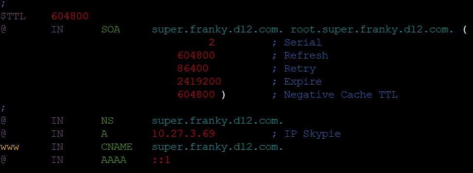

Kemudian menjalankan command `service bind9 restart`

Pada Skypie menginstal apache2, php, libapache2-mod-php7.0. Untuk command instalasinya dapat disimpan di dalam script.sh.

Langkah selanjutnya yaitu mendownload file yang diperlukan dengan command `wget https://raw.githubusercontent.com/FeinardSlim/Praktikum-Modul-2-Jarkom/main/super.franky.zip`.

Selanjutnya file di-extract menggunakan command `unzip super.franky.zip`.

Lalu berpindah ke direktori /etc/apache2/sites-available kemudian mengcopy file 000-default.conf menjadi super.franky.d12.com.conf dengan command `cp 000-default.conf super.franky.d12.com.conf`.

Mengedit file super.franky.d12.com.conf dengan command `vi super.franky.d12.com.conf` dan mengubahnya menjadi

```
ServerAdmin webmaster@localhost
DocumentRoot /var/www/super.franky.d12.com
Servername super.franky.d12.com
ServerAlias www.super.franky.d12.com
```
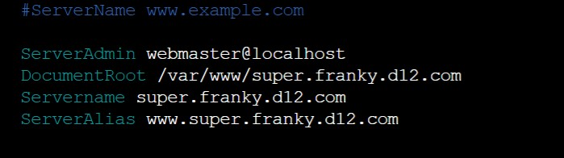

Kemudian membuat directory baru dengan nama super.franky.d12.com pada /var/www/ menggunakan command `mkdir /var/www/super.franky.d12.com`. Lalu mengcopy isi dari folder franky yang telah didownload ke /var/www/super.franky.d12.com dengan command `cp -r /root/super.franky/* /var/www/super.franky.d12.com`

Setelah itu menjalankan `command a2ensite super.franky.d12.com` dan `service apache2 restart`

Pada Water7, mengedit file dengan command `vi /etc/squid/squid.conf` menjadi
```
include /etc/squid/acl.conf
http_port 5000
visible_hostname jualbelikapal.d12.com
auth_param basic program /usr/lib/squid/basic_ncsa_auth /etc/squid/passwd
auth_param basic children 5
auth_param basic realm Proxy
auth_param basic credentialsttl 2 hours
auth_param basic casesensitive on
acl USERS proxy_auth REQUIRED
acl google dstdomain google.com
http_access deny google
deny_info http://super.franky.d12.com/ google
http_access allow USERS AVAILABLE_WORKING
http_access deny all
```
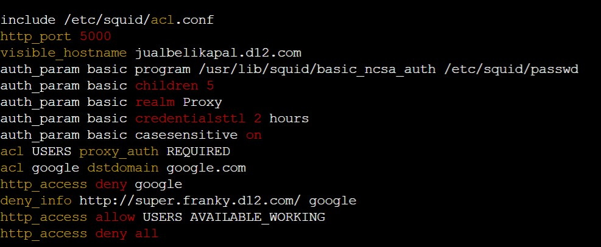

Kemudian mengedit file `/etc/resolv.conf` dan mengganti nameserver menjadi
```
    Nameserver 10.27.2.2	; IP EniesLobby
```

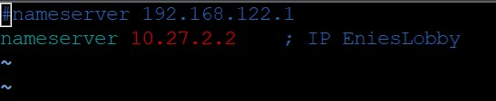

Kemudian menjalankan command `service squid restart`.

Cara mengeceknya dengan command `lynx google.com` pada client Loguetown.

## SOAL 12
Luffy dan Zoro akhirnya memutuskan untuk berlayar untuk **mencari harta karun di super.franky.yyy.com.** Tugas pencarian dibagi menjadi dua misi, Luffy bertugas untuk **mendapatkan gambar (.png, .jpg),** sedangkan Zoro **mendapatkan sisanya.** Karena Luffy orangnya sangat teliti untuk mencari harta karun, ketika ia berhasil mendapatkan gambar, ia mendapatkan gambar dan melihatnya dengan kecepatan **10 kbps.**

### Solusi:

Pada Water7, menjalankan command `vi /etc/squid/acl-bandwidth.conf` untuk membuat file `acl-bandwidth.conf` dan menambahkan script berikut

```
acl download url_regex -i .jpg$ .png$

auth_param basic program /usr/lib/squid/basic_ncsa_auth /etc/squid/passwd

acl luffy proxy_auth luffybelikapald12
acl zoro proxy_auth zorobelikapald12

delay_pools 2

delay_class 1 1
delay_parameters 1 1250/1250
delay_access 1 allow luffy
delay_access 1 deny zoro
delay_access 1 allow download
delay_access 1 deny all
```

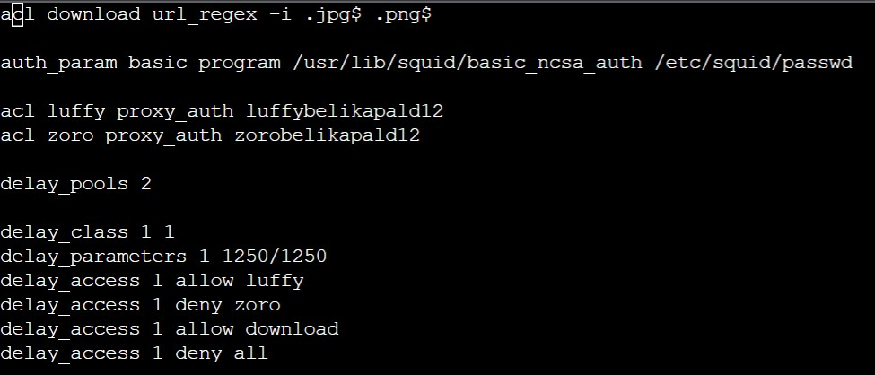

Lalu menambahkan konfigursi berikut pada file `/etc/squid/squid.conf`
```
    include /etc/squid/acl-bandwidth.conf
```

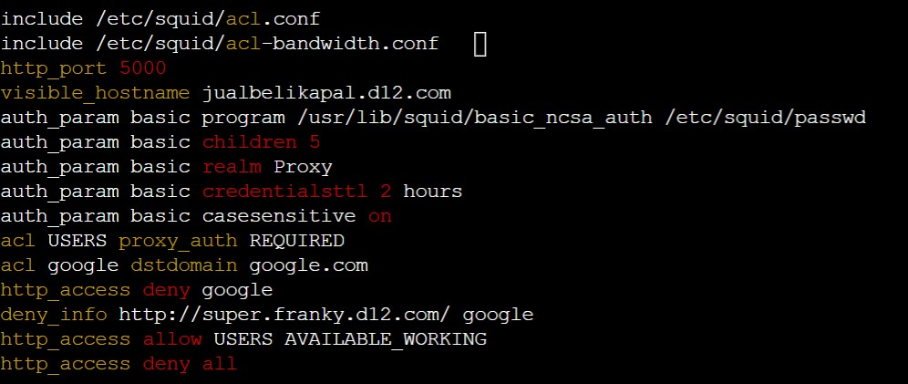

Setelah itu menjalankan command `service squid restart`.

Untuk mengeceknya menggunakan command `lynx google.com` dan akan diarahkan ke super.franky.d12.com kemudian ke folder public lalu images dan mencoba mendownload file dengan ekstensi .jpg atau .png.

## SOAL 13

Sedangkan, Zoro yang sangat bersemangat untuk mencari harta karun, sehingga kecepatan kapal Zoro tidak dibatasi ketika sudah mendapatkan harta yang diinginkannya.

### Solusi:

Pada Water7 mengedit file `acl-bandwidth.conf` dengan command `vi /etc/squid/acl-bandwidth.conf` menjadi
```
acl download url_regex -i .jpg$ .png$

auth_param basic program /usr/lib/squid/basic_ncsa_auth /etc/squid/passwd

acl luffy proxy_auth luffybelikapald12
acl zoro proxy_auth zorobelikapald12

delay_pools 2

delay_class 1 1
delay_parameters 1 1250/1250
delay_access 1 allow luffy
delay_access 1 deny zoro
delay_access 1 allow download
delay_access 1 deny all

delay_class 2 1
delay_parameters 2 -1/-1
delay_access 2 allow zoro
delay_access 2 deny luffy
delay_access 2 deny all
```

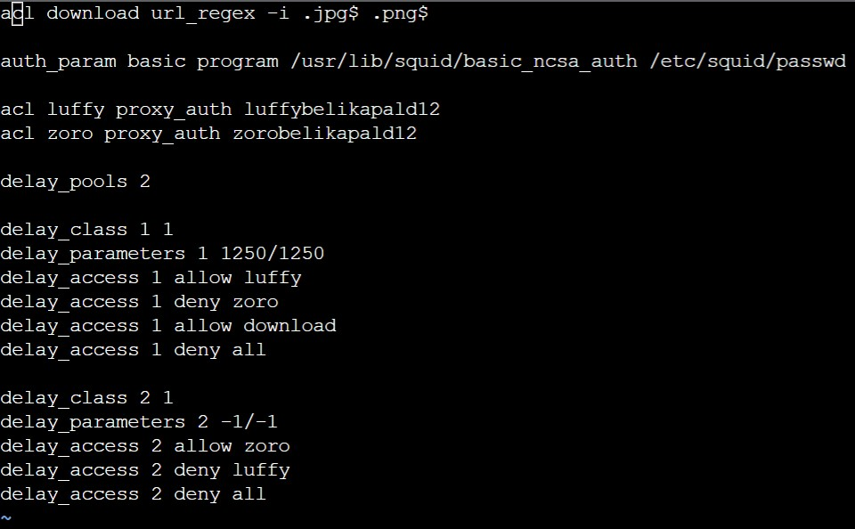

Setelah itu, menjalankan command `service squid restart`.

Untuk mengeceknya menggunakan command `lynx google.com` dan akan diarahkan ke super.franky.d12.com kemudian ke folder public lalu images dan mencoba mendownload file dengan ekstensi .jpg atau .png.


## Kendala Selama Pengerjaan

Adapun beberapa kendala yang kami alami selama pengerjaan soal yaitu sebagai berikut:

- Pada soal nomor 2, mengalami kendala mengenai dhcp relay karena tidak dijelaskan di dalam modul.
- Pada soal nomor 10, mengalami kendala mengenai pengaturan pembatasan waktu akses.
- Pada soal nomor 12 dan 13, mengalami kendala mengenai pengaturan pembagian bandwidth.
- Mengalami beberapa kesalahan penulisan command.
